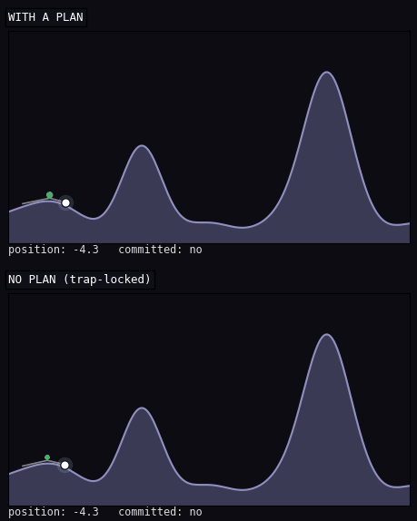
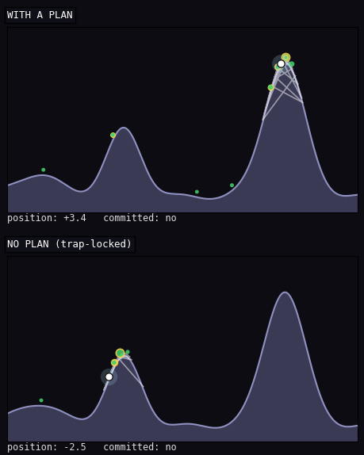

# THE TERRARIUM — the IBF/MSCN apparatus, visible

One living world; every validated capability an episode a novice can
follow in one sentence. **The numbers on the front stage are exactly
the backstage paired-CI means** (8+ seeds, `mscn/stats.py`) — never
prettified. Each episode re-demonstrates a measured result from
`mscn/ARCHITECTURE.md` §9–§11; where the science says *null*, the
showcase says so too (see the “what doesn’t help” panel).

Reproduce: `python -m mscn.terrarium_episodes --episode all --render`

## Episode 4 — The Canyon

> *“It walks DOWN into the canyon because it knows what's beyond.”*

**Mechanism made visible:** model-based planning + U8 option commitment

**Novice scoreboard** (these ARE the measured means):

- reached the far side: with a plan 10/10 journeys; without 0/10 (stuck on the tempting little hill)

**Backstage (the real benchmark):**

- planner-vs-none tail coherence, paired: +1.411 [+1.372, +1.451] + (sig) — ancestor §9.2 corridor cell (+1.40*, the only starred positive planning cell in the matrix)
- honest scope (ancestor kept): planning binds ONLY in this discrete low-branching structure — in open 2-D terrain both pre-registered planning criteria came back null (§9.2); see the “what doesn’t help” panel.
