# THE TERRARIUM — the IBF/MSCN apparatus, visible

One living world; every validated capability an episode a novice can
follow in one sentence. **The numbers on the front stage are exactly
the backstage paired-CI means** (8+ seeds, `mscn/stats.py`) — never
prettified. Each episode re-demonstrates a measured result from
`mscn/ARCHITECTURE.md` §9–§11; where the science says *null*, the
showcase says so too (see the “what doesn’t help” panel).

Reproduce: `python -m mscn.terrarium_episodes --episode all --render`

## Episode 1 — The Two Twins

> *“Winter came. The forgetful twin lost the map; ours kept it.”*

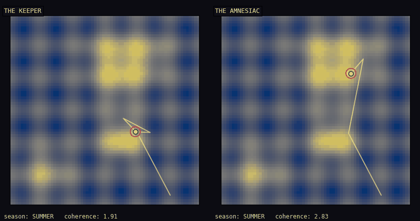
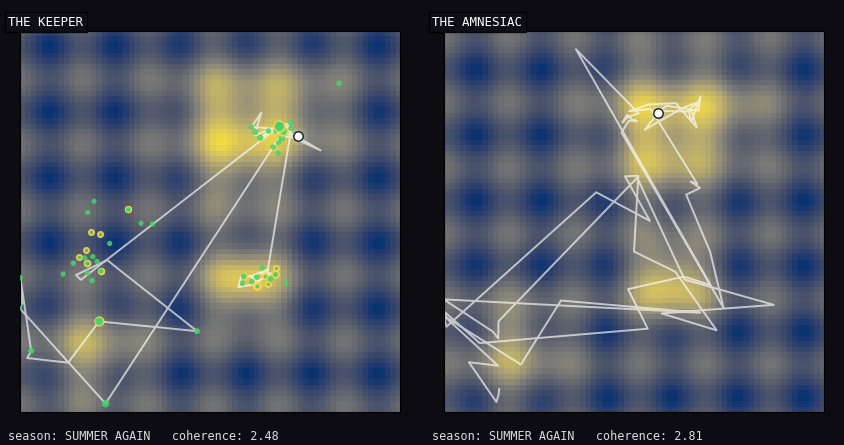

**Mechanism made visible:** continual memory (the one universally significant stage)

**Novice scoreboard** (these ARE the measured means):

- home quality after winter: keeper 3.33 vs amnesiac 2.11 (coherence, higher better)
- time living in the best meadow after winter: keeper 55% vs amnesiac 30%

**Backstage (the real benchmark):**

- recovered asymptote (A2 tail), paired over 8 seeds: +1.221 [+0.583, +1.860] + (sig) — ancestor §9.6 G2 (+sig)
- home-basin occupancy diff: +0.246 [-0.145, +0.636] 0 (ns)
- honest note (ancestor kept): keeper's own relearning savings -12 [-76, +51] ticks — memory buys the recovered asymptote, NOT relearning speed; the winter residue slows the first re-climb.

## Episode 2 — The Earthquake

> *“Knocked across the map, it walks straight home.”*

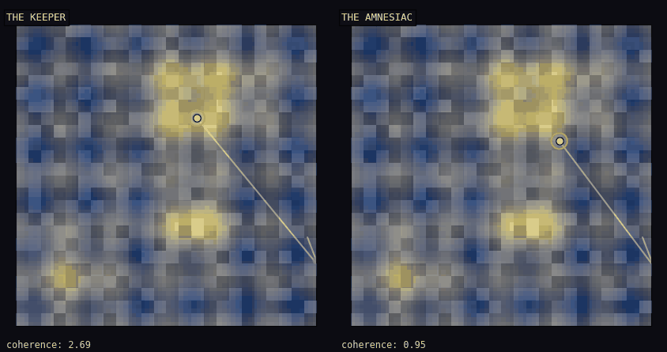
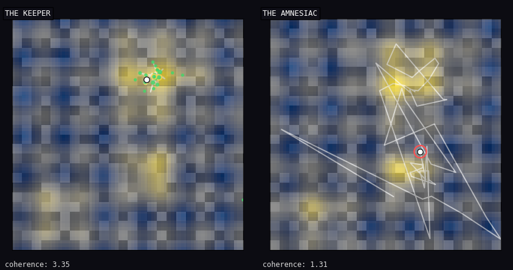

**Mechanism made visible:** consolidation + warm-jump homing (memory under shocks)

**Novice scoreboard** (these ARE the measured means):

- life quality in quake country: keeper 3.14 vs amnesiac 2.09
- ticks to walk home after a quake: keeper 3 vs amnesiac 8

**Backstage (the real benchmark):**

- tail coherence, paired over 8 seeds: +1.042 [+0.741, +1.344] + (sig) — ancestor §9 V1 (+1.18 sig) / shocked matrix cell
- recovery-time diff (presentation metric, no ancestor): -4.742 [-8.556, -0.928] - (sig)

## Episode 3 — The Mirage Field

> *“It paints an X on every lie it has personally checked.”*

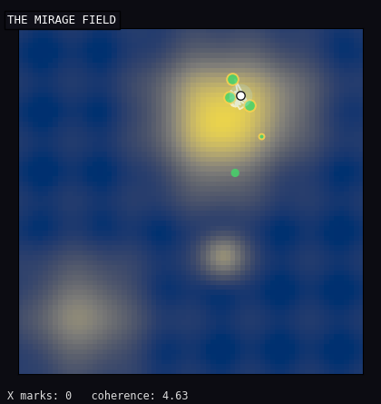

**Mechanism made visible:** SIGNED corrections (Postulate IV) — and their habitat map

**Novice scoreboard** (these ARE the measured means):

- time at already-checked mirages: signed 92% vs forgiving twin 89% (the ink does NOT buy escape here)
- where the red ink saves lives: the judge's arena — the forgiving memory forgets 0.34 of what it knew under contradiction; the signed one 0.01

**Backstage (the real benchmark):**

- NAVIGATOR (matched no-restart twins — NOT the §10.2 protocol, which compared restart-enabled agents): net coherence -0.409 [-0.676, -0.143] - (sig); checked-mirage dwell +0.027 [-0.327, +0.381] 0 (ns) — dwell registration NOT MET. The measured reading: in open navigation the X-ink does not buy escape, and under the no-restart policy the signed organ measurably COSTS tail coherence here — ULTRA's weakness in this regime, shown, not hidden (attribution signed-erosion vs local-k: open item).
- EVALUATOR (ancestor §10.1, re-demonstrated): the non-negative substrate's EXTRA forgetting under exact contradiction +0.322 [+0.130, +0.513] + (sig) — suppression is structurally impossible for non-negative memory (Thm-8a special case); signed corrections are load-bearing exactly there.

## Episode 4 — The Canyon

> *“It walks DOWN into the canyon because it knows what's beyond.”*

**Mechanism made visible:** model-based planning + U8 option commitment

**Novice scoreboard** (these ARE the measured means):

- reached the far side: with a plan 10/10 journeys; without 0/10 (stuck on the tempting little hill)

**Backstage (the real benchmark):**

- planner-vs-none tail coherence, paired: +1.411 [+1.372, +1.451] + (sig) — ancestor §9.2 corridor cell (+1.40*, the only starred positive planning cell in the matrix)
- honest scope (ancestor kept): planning binds ONLY in this discrete low-branching structure — in open 2-D terrain both pre-registered planning criteria came back null (§9.2); see the “what doesn’t help” panel.

## Episode 5 — The Trade

> *“They trade maps — until one stops giving.”*

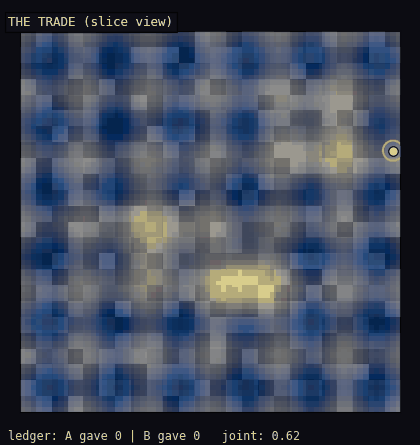
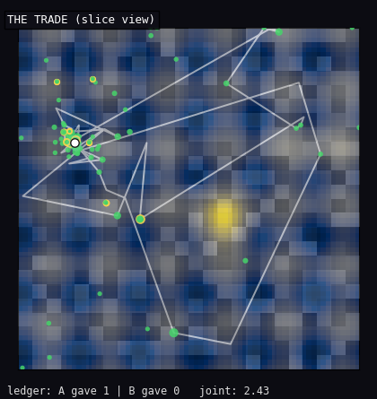

**Mechanism made visible:** reciprocity-ledgered transfer (6.4, EC-4)

**Novice scoreboard** (these ARE the measured means):

- the big lesson this episode taught US: a result we once celebrated did not survive a fresh re-run — so we say so, in the show itself
- the bookkeeping still works: an honest pair trades 3.9 maps; a freeloader gets cut off after 1.4
- does trading make the pair richer? not reliably: 4.59 together vs 4.85 alone (a coin-flip difference)

**Backstage (the real benchmark):**

- REPLICATION CATCH (§11.3, the fifth): ancestor §9 V5 / 6.4 recorded +0.54 [+0.01, +1.08] sig; this re-run (verified float-identical runner, same seeds/protocol, fresh numpy): -0.263 [-0.921, +0.394] 0 (ns) — fragile significance is not significance; the claim reverts to unsupported pending higher power.
- defector's payoff: -0.036 [-0.396, +0.324] 0 (ns) — defection still does not pay (class unchanged)
- what stands: the reciprocity LEDGER mechanism — credit-gated giving measurably cuts a parasite off — and the 2-D null (sharing is worthless where discovery is cheap).

## Episode 6 — The Chess Garden

> *“Nobody taught it the rules. Watch the legal-move halo grow.”*

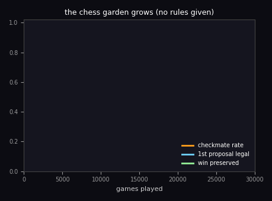
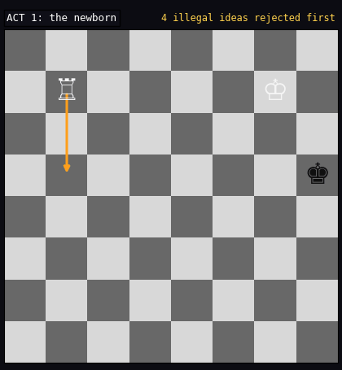
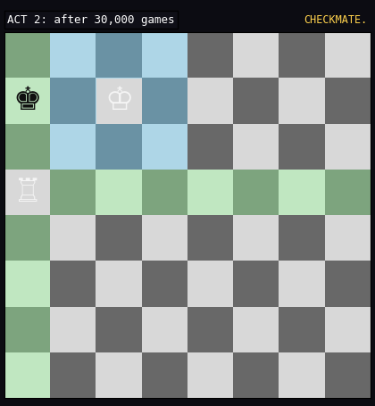

**Mechanism made visible:** rules from rejections + value from outcomes (TD = MODIFY)

**Novice scoreboard** (these ARE the measured means):

- checkmates: 0.8% of games as a newborn → 66% after 30,000 games (nobody ever told it how pieces move)
- its first suggestion is a legal move 91% of the time (was 68%)
- once winning, it stays winning 99% of moves

**Backstage (the real benchmark):**

- mate rate, 3 seeds × 30,000 episodes: 0.008 → 0.665 [0.644, 0.685] — ancestor §9.4 (0.526 @16k, 0.732 @150k, +0.72 sig)
- value ablation cited from §9.4: legality-only mate rate 0.006 — the TD-as-modification value loop IS the strength (+0.73 sig)
- honest ceilings carried (§9.4/§9.6 G4): DTM-optimality plateaus ~0.26-0.34 (safe long before fast), and against the tablebase-OPTIMAL defender the mate rate collapses 0.64 → 0.03 — winning vs weak defence only; the optimality gap is the named frontier.

## Episode 7 — The Grand Tour (no bells)

> *“No one rings a bell when winter comes. It notices.”*

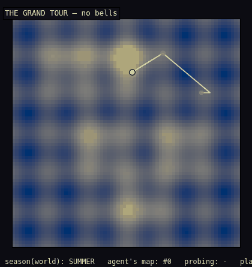
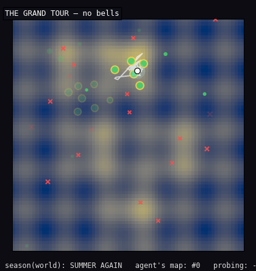

**Mechanism made visible:** U-1 self-detected contexts + U-2 equipment, end to end

**Novice scoreboard** (these ARE the measured means):

- life quality after an unannounced winter and an earthquake: 3.26 — the same class as an agent that was TOLD the seasons (3.4-3.6)
- it noticed winter within ~4 ticks and recognised the returned summer in 5/8 of its lives — and never once hallucinated a season that wasn't there

**Backstage (the real benchmark):**

- A2 tail over 8 unbelled lives: 3.26 [1.90, 4.62] — §11.1 P4 MET (vs canonical Unified −0.105 [−0.587, +0.378] ns)
- detection: split latency ~4 ticks (11/12), re-bind 8/12 lives @ ~18 ticks, ZERO false events in 24 stationary runs (P3 MET)
- carried weakness (§11.1 P1 NOT MET, −235%): self-detection does NOT recover the given-bell transplant's relearning-SPEED savings — missed recognitions are costly; what memory actually buys (§9.6), the recovered asymptote, is kept without any bell.

## The honest panel — what doesn’t help (and why)

A showcase you can trust must show the nulls. Every line below is a measured
result (paired CIs in `mscn/ARCHITECTURE.md`), kept on stage:

- **Planning in open terrain** (§9.2): both pre-registered planning criteria
  in continuous 2-D came back NOT MET — shallow barriers yield to Boltzmann
  diffusion anyway; deep ones hide their prize. Planning binds only in
  discrete, low-branching structure (the canyon, +1.43 sig here).
- **Error-gated dissolution** (§9 V1): null at proper power (−0.05 [−0.21,
  +0.12]) — base decay already does the work at these timescales.
- **Restart teleports (two-sided k)** (§9.1): the only stage with
  significantly HARMFUL cells (shocked −0.30*, moat −0.15*) — ULTRA carries
  a “restarts never” policy.
- **Trading maps** (§9 V5 / §11.3): in 2-D a NULL (solo discovery is cheap);
  and the 3-D scarce-regime significance (+0.54 [+0.01, +1.08]) **failed
  replication** in this environment (−0.26 ns, same code/seeds/protocol) —
  the fifth fragile-significance catch. What stands is the ledger mechanism,
  not the value claim.
- **The crucible under shared input regions** (§10): cross-context
  verification ERODES home truth when contexts revisit the same places
  (+0.217 forgetting vs gating-only +0.012); ULTRA enables it only on
  separated context clouds — in these worlds, never.
- **X-marks in the open desert** (E3, §10.2): signed memory visibly marks
  checked mirages, but in open navigation it buys no significant net
  coherence (ns) and not even lower mirage-dwell (registration NOT MET);
  its load-bearing habitat is the evaluator arena (+0.32 [+0.13, +0.51] sig)
  — and under the no-restart policy the signed organ measurably COSTS on the
  deceptive tail (−0.41 [−0.68, −0.14], a new fact from the matched pair).
- **Self-detection’s relearning speed** (§11.1): P1 NOT MET (−235% of the
  given-bell repair) — missed recognitions are expensive; the recovered
  asymptote is what survives bell-free (P4 MET).

